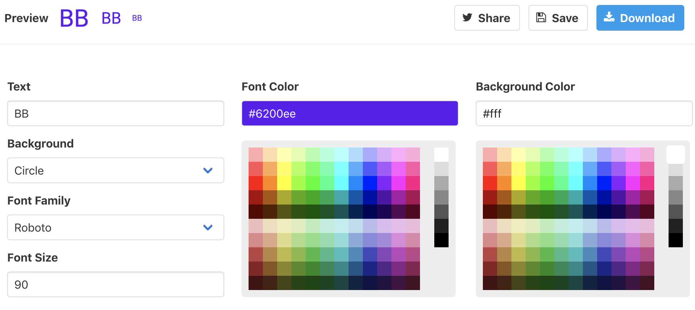

<p align="center"></p>

# Duo Ludio

Check it out [here](https://duo-ludio.netlify.com/)!

For a person who needs help concentrating, Duo Ludio is a web app that provides categorized binaural beats. Unlike other binaural beats players, this product is accessible anywhere since it has the option of being installed offline on any device.

The name Duo Ludio is Latin for "Two Player" ("Two" for binaural beats).

## Installation

1. Install [node.js 10](https://nodejs.org/en/download/).
1. Clone the repository using one of the following methods.
    - SSH: `git clone git@github.com:neelkamath/duo-ludio.git`
    - HTTPS: `git clone https://github.com/neelkamath/duo-ludio.git`
1. `cd duo-ludio`
1. `npm i`

## Usage

### Development

1. `npm run dev`
1. Open `src/index.html` in your browser.

### Production

`npm run build`

The `dist/` directory will contain the built website.

### Documentation

1. `npm run doc` 
1. Open `docs/index.html` in your browser.

## Testing

`npm run test`

## Documentation

The Material Design spec is not to be followed strictly, but as a guideline.

### TypeScript

Parcel leaks an implementation detail for certain uses of `async`/`await` (see [this issue](https://github.com/parcel-bundler/parcel/issues/1762#issuecomment-504389468)). As a workaround, the statement `import 'regenerator-runtime/runtime';` is included in certain files.

### Binaural Beats

The binaural beats used are from the [v4.0.0](https://github.com/neelkamath/binaural-beats-dataset/releases/tag/v4.0.0) release of the Binaural Beats Dataset. The `src` directory from the dataset is saved as `src/binaural_beats` in this repo.

### Continuous Deployment

Continuous delivery has been setup using [Netlify](https://www.netlify.com), which automatically deploys all commits to the `master` branch.

### Favicon

[favicon.io](https://favicon.io/favicon-generator/) is used to generate the favicon. When styling the favicon on their site, follow [Vaadin's Material Design specs](https://cdn.vaadin.com/vaadin-material-styles/1.2.0/demo/index.html). This means setting up as shown below.



### Storage

`localForage` is used to persist data. To access metadata on binaural beats (which are stored in `src/binaural_beats/data.json`), use the abstraction layer `src/ts/storage/beats.ts`. The abstraction layer for the `categories` item is `src/ts/storage/categories.ts`.

Each track is downloaded a `localForage` item of the same name. For example, `Alpha_8_Hz.mp3`'s `Blob` is saved to the `Alpha_8_Hz.mp3` item.

The `categories` item contains the user's binaural beats collection. Each key is the name of a category. Each value is an `array` of `string`s denoting the names of tracks. Track names correspond to tracks in the directory `src/binaural_beats/tracks/`. An example is shown below.
```json
{
  "Meditation": [
    "Theta_6_Hz_Isochronic_Pulses.mp3"
  ]
}
```

### Web Components

All web components are imported in `src/ts/web_components/components.ts`.

When using TypeDoc to document web components, use the custom `@attribute` field to document the element's attributes.

Mandatory attribute documentation example:
```
@attribute `aria-label` (required) ARIA label (e.g., `Confirm deleting category Meditation`)
```
Optional attribute documentation example:
```
@attribute `aria-label` (optional, default: `Confirm`) ARIA label (e.g., `Confirm deleting category Meditation`)
```

TypeDoc does'nt allow you to use the `event` in places such as constructors. A workaround is to document `Event`s by creating and documenting `private` methods which dispatch them.

## Credits

- Description: [How to Create a Product Vision by Joel Spolsky](https://www.joelonsoftware.com/2002/05/09/product-vision/)
- Favicon: [favicon.io](https://favicon.io/favicon-generator/)
- [Website Boilerplate](https://github.com/neelkamath/website-boilerplate)
- [Binaural Beats Dataset](https://github.com/neelkamath/binaural-beats-dataset)

## License

This project is under the [MIT License](LICENSE).
